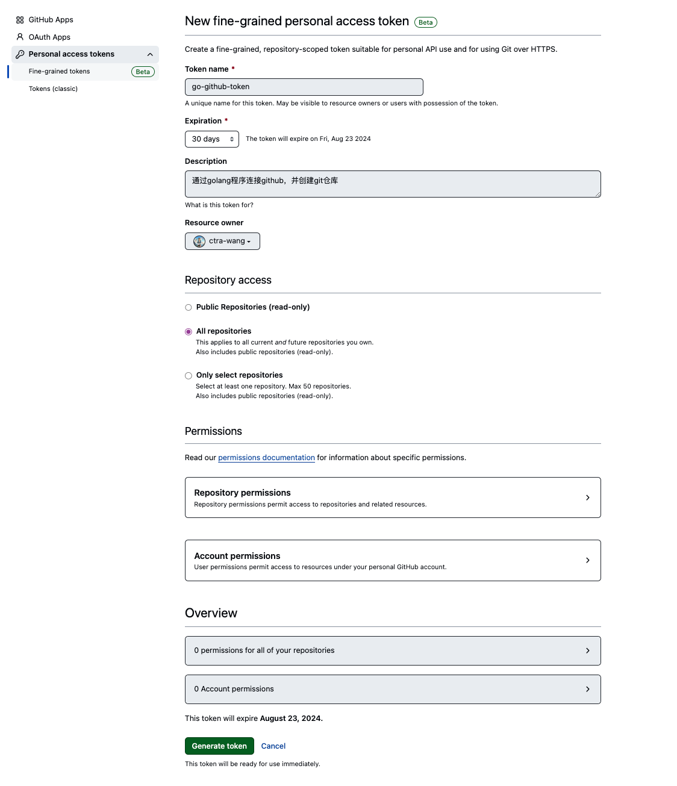
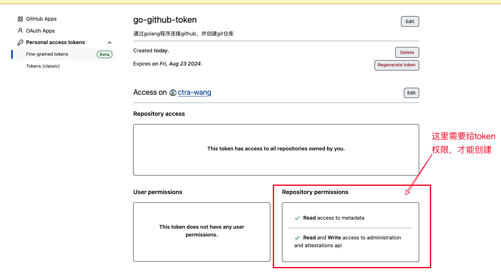

# 一、GIT仓库

## 1、Github

### 1.1、获取 Github AccessToken

#### 1）登录 GitHub:

前往 GitHub 并使用你的账号登录。

#### 2）前往开发者设置:

点击右上角的头像，选择 "Settings" 以打开个人设置页面。
在左侧栏中，滚动到 "Developer settings" 并点击它。
#### 3）生成新的个人访问令牌:

在 "Developer settings" 下，选择 "Personal access tokens"。
点击 "Generate new token" 按钮。
#### 4）配置访问权限:

给你的访问令牌命名，这有助于你以后识别它的用途。
选择需要的访问权限（Scopes）。如果你需要创建或修改仓库，至少需要勾选 repo 相关的权限。
选择好权限后，点击 "Generate token"。
#### 5）复制访问令牌:

GitHub 会生成一个新的令牌，并显示在页面上。这是你唯一一次能看到这个令牌，务必将它保存到安全的地方。如果丢失，你需要重新生成一个新的令牌。
复制这个令牌，作为 your_access_token 用于 API 请求中。

## 2、Gitee

## 3、Gitea

> 官方网址：
> [https://cloud.gitea.com/signin?redirect=/instances](https://cloud.gitea.com/signin?redirect=/instances) 

## 4、Gitlab

> 官方网址：
> [https://gitlab.com/](https://gitlab.com/)

